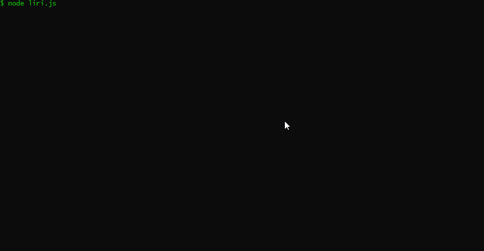

# LIRI Bot
LIRI Bot is a CLI APP that utilizes the Spotify, IMDB and Bandsintown API and gives the user the option to search for a Song, a Movie or Band/Artist. When searching for a Song or Movie, the user will get info regarding that Song or Movie. When searching for a Band/Artist, the user will be given info regarding the upcoming performances. This is a simple APP to demonstrate the usage of the below technologies.

## Technologies

* NodeJS
* JavaScript
* Spotify API
* Bandsintown API
* OMDB API
* npm spotify-web-api-node
* npm inquirer
* npm axios
* npm moment
* npm dotenv
* npm colors
* npm fs

### npm Module Dependencies
spotify-web-api-node, inquirer, axios, moment, dotenv, colors


## Deployment

1. Clone or download repo to your computer
2. Open Git Bash in the root directoy
3. In the terminal run `npm install`
4. Wait for Dependencies to install
5. In the terminal run `node liri.js`
6. Follow the prompts and enjoy!

### Note regarding Spotify API
* For Spotify to work, you will need to register for your own API key from Spotify and add it in a `.env` file in the root directory. Please do the following:
1. Optain a Spotify API Key. It's free!
   * Step One: Visit <https://developer.spotify.com/my-applications/#!/>

   * Step Two: Either login to your existing Spotify account or create a new one (a free account is fine) and log in.

   * Step Three: Once logged in, navigate to <https://developer.spotify.com/my-applications/#!/applications/create> to register a new application to be used with the Spotify API. You can fill in whatever you'd like for these fields. When finished, click the "complete" button.

   * Step Four: On the next screen, scroll down to where you see your **client id** and **client secret**. Copy these values down.
2. Next, create a file named `.env` in the root directory and add the following to it, replacing the values in the quotes with your API keys:

```js
# Spotify API keys

SPOTIFY_ID="your-spotify-id"
SPOTIFY_SECRET="your-spotify-secret"

```


## Demo

